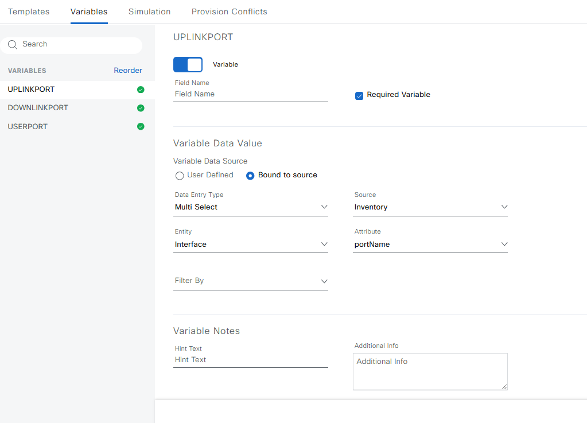
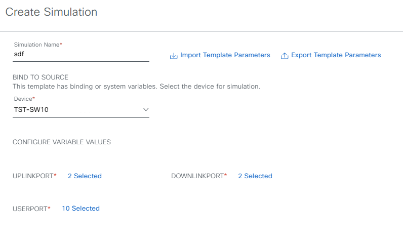

# Interface configuration
To help with interface configuration we will use the built ind bindings.

Let us assume we have different interface types we need to configure:
- Uplinks
- Downlinks
- User ports
- Printer ports
- Access Point Ports

## Uplink
The default configuration on an uplink port will look something like this:
```
interface GigabitEthernet1/0/1
 description UPLINK -> DKDEM01SW01
 switchport
 switchport encapsulation dot1q
 switchport mode trunk
 switchport nonegotiate
 ip dhcp snooping trust
```

## Downlink
The default configuration on an downlink port will look something like this:
```
interface GigabitEthernet1/0/2
 description DOWNLINK -> DKDEM01SW10
 switchport
 switchport encapsulation dot1q
 switchport mode trunk
 switchport nonegotiate
```

## User port
The default configuration on an user port will look something like this:
```
interface GigabitEthernet1/0/2
 description < USERPORT >
 switchport
 switchport mode access
 switchport access vlan 10
 spanning-tree portfast
 switchport port-security maximum 2
 switchport port-security violation protect
 switchport port-security
 storm-control broadcast level pps 1k
 storm-control multicast level bps 10m
 storm-control unknown-unicast level pps 100
```

## Print port
The default configuration on a printer port will look something like this:
```
interface GigabitEthernet1/0/2
 description < PRINTER >
 switchport
 switchport mode access
 switchport access vlan 110
 spanning-tree portfast
 speed 100
 switchport port-security maximum 2
 switchport port-security violation protect
 switchport port-security mac-address sticky
 switchport port-security mac-address sticky 5254.001a.84fd
 switchport port-security
 storm-control broadcast level pps 1k
 storm-control multicast level bps 10m
 storm-control unknown-unicast level pps 100
```

# CLI Template
```

interface {{port}}
 description UPLINK -> DKDEM01SW01
 switchport
 switchport encapsulation dot1q
 switchport mode trunk
 switchport nonegotiate
 ip dhcp snooping trust
!



interface {{port}}
 description DOWNLINK -> DKDEM01SW10
 switchport
 switchport encapsulation dot1q
 switchport mode trunk
 switchport nonegotiate
!



interface {{port}}
 description < USERPORT >
 switchport
 switchport mode access
 switchport access vlan 10
 spanning-tree portfast
 switchport port-security maximum 2
 switchport port-security violation protect
 switchport port-security
 storm-control broadcast level pps 1k
 storm-control multicast level bps 10m
 storm-control unknown-unicast level pps 100
!

```
# Variable definition
All variable definitions will be the same as the UPLINKPORT shown here:


## Simulation
Running the simulation


**Simulation output**
```
interface TenGigabitEthernet1/1/1
 description UPLINK -> DKDEM01SW01
 switchport
 switchport encapsulation dot1q
 switchport mode trunk
 switchport nonegotiate
 ip dhcp snooping trust
!
interface TenGigabitEthernet1/1/2
 description UPLINK -> DKDEM01SW01
 switchport
 switchport encapsulation dot1q
 switchport mode trunk
 switchport nonegotiate
 ip dhcp snooping trust
!

interface TenGigabitEthernet1/1/3
 description DOWNLINK -> DKDEM01SW10
 switchport
 switchport encapsulation dot1q
 switchport mode trunk
 switchport nonegotiate
!
interface TenGigabitEthernet1/1/4
 description DOWNLINK -> DKDEM01SW10
 switchport
 switchport encapsulation dot1q
 switchport mode trunk
 switchport nonegotiate
!

interface GigabitEthernet1/0/1
 description < USERPORT >
 switchport
 switchport mode access
 switchport access vlan 10
 spanning-tree portfast
 switchport port-security maximum 2
 switchport port-security violation protect
 switchport port-security
 storm-control broadcast level pps 1k
 storm-control multicast level bps 10m
 storm-control unknown-unicast level pps 100
!
interface GigabitEthernet1/0/10
 description < USERPORT >
 switchport
 switchport mode access
 switchport access vlan 10
 spanning-tree portfast
 switchport port-security maximum 2
 switchport port-security violation protect
 switchport port-security
 storm-control broadcast level pps 1k
 storm-control multicast level bps 10m
 storm-control unknown-unicast level pps 100
!
```
