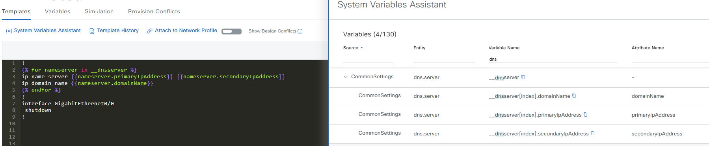

# System Variables
Within the Catalyst Center some variable for the sites are configured under the Design menu.

The variables defined here can be access in system variables in Jinja Templates


## CLI Template
```
!

ip name-server {{nameserver.primaryIpAddress}}

ip domain name {{__dnsserver[0].domainName}}
!
interface GigabitEthernet0/0
 shutdown
!
```
