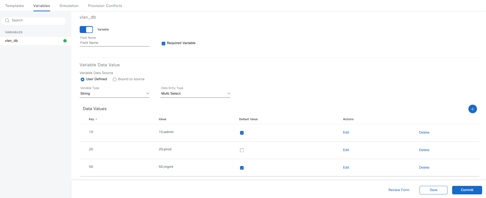
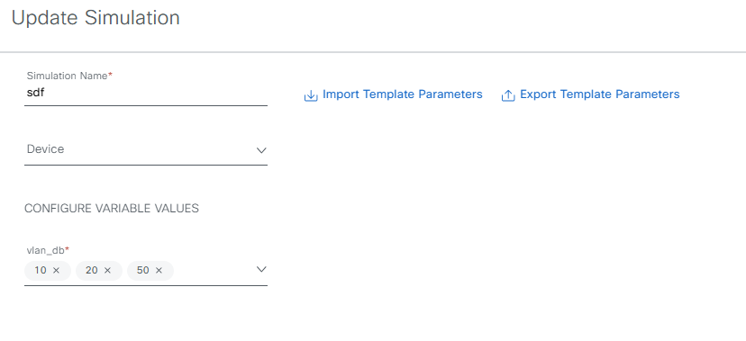

# VLANs
Creating and managing VLANs is easy using the built in variable editor and the variable system.

In this example I have created a multi-select variable where we can select the VLANs we need to create on the switch and provision the template.
## CLI Template
```


vlan {{ vlansplit[0] }}
 name {{ vlansplit[1] }}
!

```
## Variable definitions


## Simulation
Running the simulation


**Simulation output**
```
vlan 10
 name admin
!
vlan 20
 name prod
!
vlan 50
 name mgmt
!
```
